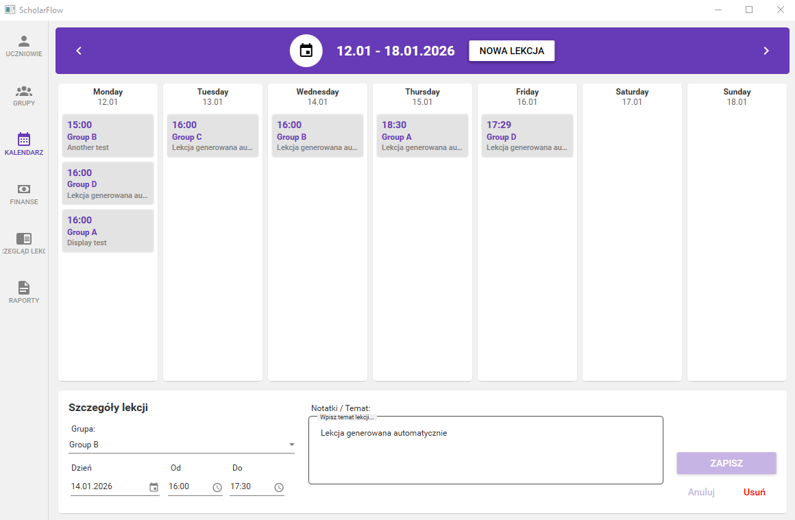
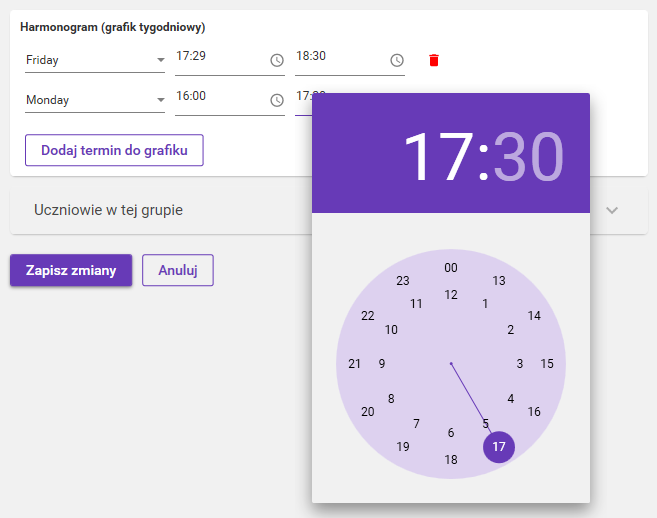
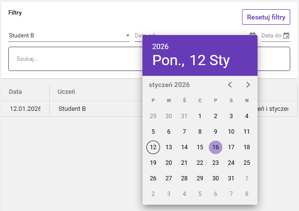
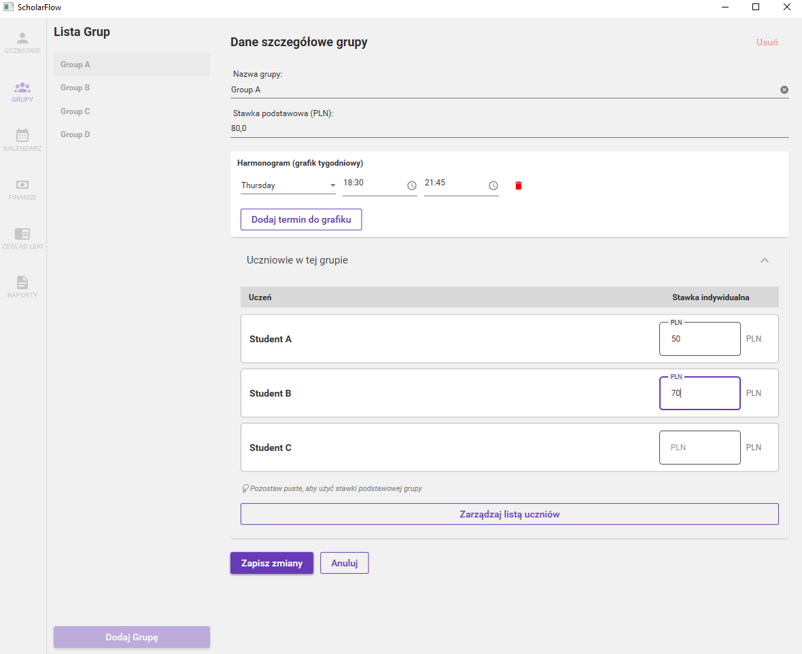
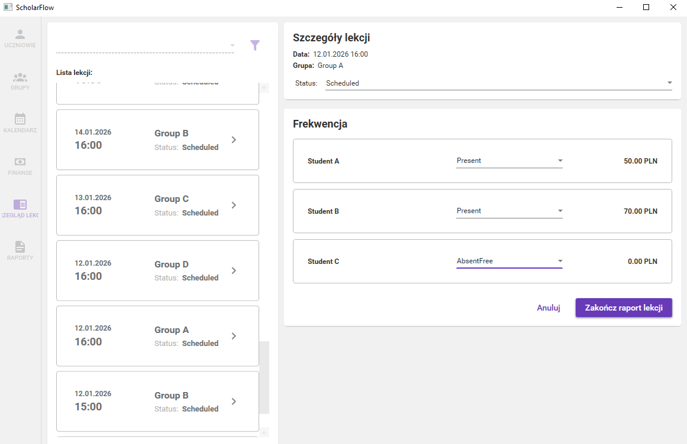

# Learning Management System (LMS)

A desktop-based management system tailored for private tutoring and language schools. Built with **.NET 9** and **WPF**, it handles the complex workflow of student enrollments, automated scheduling, and financial settlements.

---


## User-Centric Features

The application focuses on teacher productivity through intuitive UX and automated workflows.

### Interactive Weekly Calendar
<p align="center">
  
</p>
Visual dashboard for effortless browsing and managing lessons. Allows for a quick overview of the entire week with status indicators for different lesson types, ensuring clear visibility of the schedule.

### Automated Schedule Engine and Smart Sync
<p align="center">
  
</p>
Recurring time slots automatically generate lessons for the entire school year. Any schedule change is instantly propagated to future lessons while preserving historical logs and attendance records to maintain data consistency.

### Advanced Filtering and Search System
<p align="center">
  
</p>
To handle large datasets efficiently, the application includes comprehensive search fields and multi-criteria filters. Teachers can quickly locate specific students, lessons, or transactions, significantly reducing administrative overhead.

### Smart State Management and Validation
<p align="center">
  
</p>
Navigation controls are intelligently disabled during edit mode to prevent accidental data loss. Robust input validation ensures prices, dates, and student records are accurate and conform to required formats.

### Flexible Pricing and One-Click Settlements
<p align="center">
  
</p>
Support for Individual Rate Overrides allows for customized pricing for specific students. Marking attendance automatically triggers balance updates, seamlessly handling presence and "Paid Absence" scenarios in real-time.

---


## Architecture & Engineering
This project was built with a focus on Clean Architecture and maintainability:
* **Pattern:** Strict MVVM using CommunityToolkit.Mvvm.
* **Service Layer:** Business logic decoupled from ViewModels via Dependency Injection.
* **Data Persistence:** Entity Framework Core (Code-First) with migrations.
* **Async Everything:** Full use of Task and ValueTask for responsive UI.

## Core Modules

### Smart Scheduling & Sync
* **Automated Generation:** Lessons generated based on recurring group schedules.
* **Intelligent Recalculation:** Updates future lessons while preserving historical data.

### Automated Billing System
* **Virtual Wallet:** Real-time balance tracking for students.
* **Dynamic Charging:** Automatic debiting based on BaseRate or IndividualRate overrides.
* **Audit Trail:** Every financial movement is logged for full traceability.

### Member Reconciliation Logic
Custom algorithm for synchronizing many-to-many relationships (Students <-> Groups) without Primary Key conflicts.

---

## Tech Stack
* **Runtime:** .NET 9 (WPF)
* **ORM:** EF Core
* **DI:** Microsoft Dependency Injection
* **UI:** XAML + Material Design

---

## Technical Deep Dive

### Financial Integrity & Dynamic Charging
The system automatically calculates lesson fees by checking for individual student rate overrides before falling back to the group's base rate. This ensures flexible billing while maintaining data integrity.

Example implementation from PaymentService:

```csharp
public async Task UpdateWalletsFromLessonAsync(int lessonId) 
{
    var lesson = await _db.Lessons
        .Include(l => l.Group)
        .Include(l => l.Attendances)
            .ThenInclude(a => a.Student)
            .ThenInclude(s => s.Enrollments)
        .FirstOrDefaultAsync(l => l.Id == lessonId);

    if (lesson == null || lesson.Status != LessonStatus.Completed) return;

    foreach (var attendance in lesson.Attendances) 
    {
        decimal priceToCharge = 0;
        if (attendance.Status == AttendanceStatus.Present || attendance.Status == AttendanceStatus.AbsentPaid) 
        {
            var enrollment = attendance.Student.Enrollments
                .FirstOrDefault(e => e.GroupId == lesson.GroupId);
            
            priceToCharge = enrollment?.IndividualRate ?? lesson.Group.BaseRate;
        }
        attendance.PriceCharged = priceToCharge;
    }
    await _db.SaveChangesAsync();
}
```
---

## How to Run
1. Ensure you have .NET 9 SDK and Visual Studio 2022.
2. Clone: git clone https://github.com/your-username/lms-project.git
3. Update connection string in appsettings.json.
4. Run Update-Database in Package Manager Console.
5. Press F5 to build and run.

## License
Copyright (c) [Twoje Imię i Nazwisko]. All rights reserved.
The source code is provided for portfolio demonstration purposes only. 
No part of this project may be copied, modified, or distributed for commercial purposes without explicit permission.

---
*Developed with focus on Clean Code by [Twoje Imię/Nick]*
